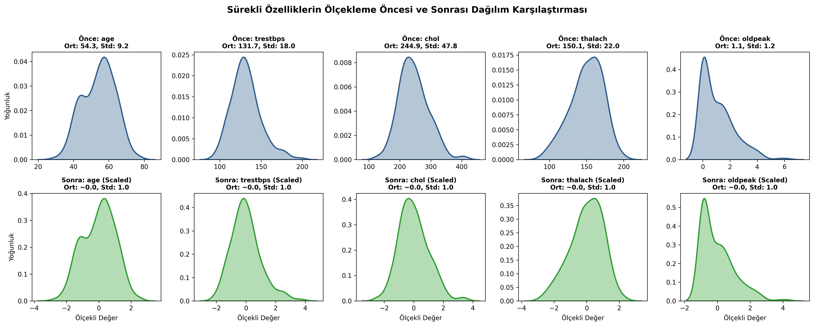
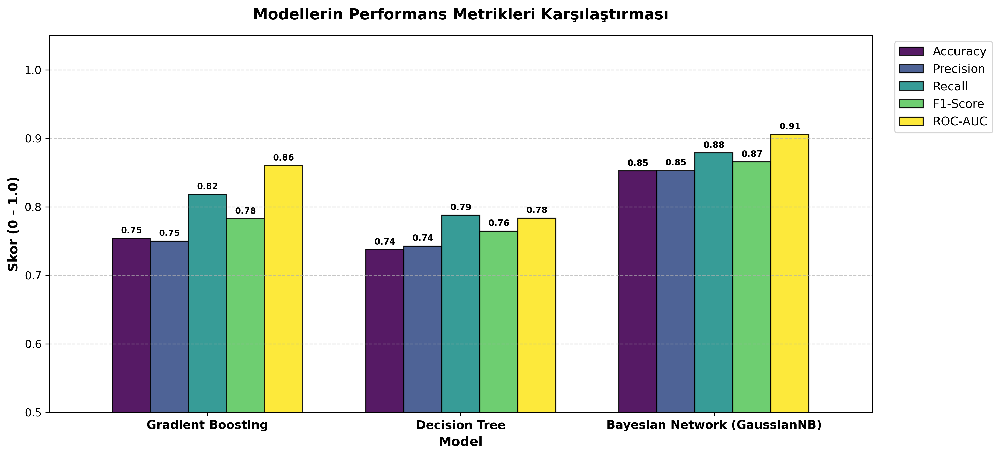
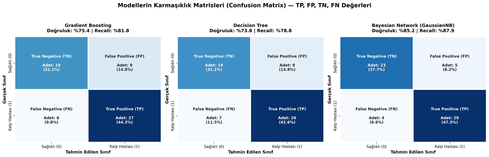
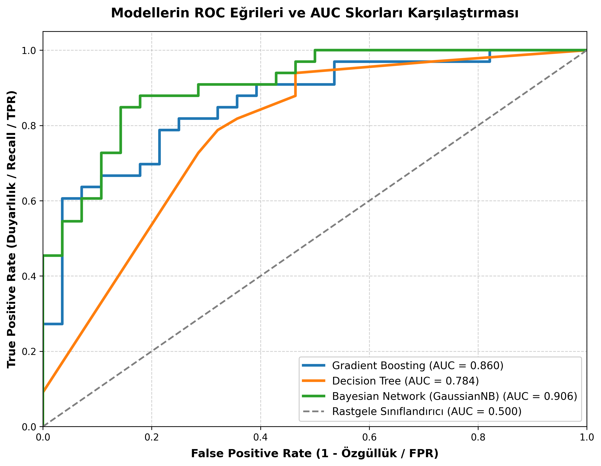
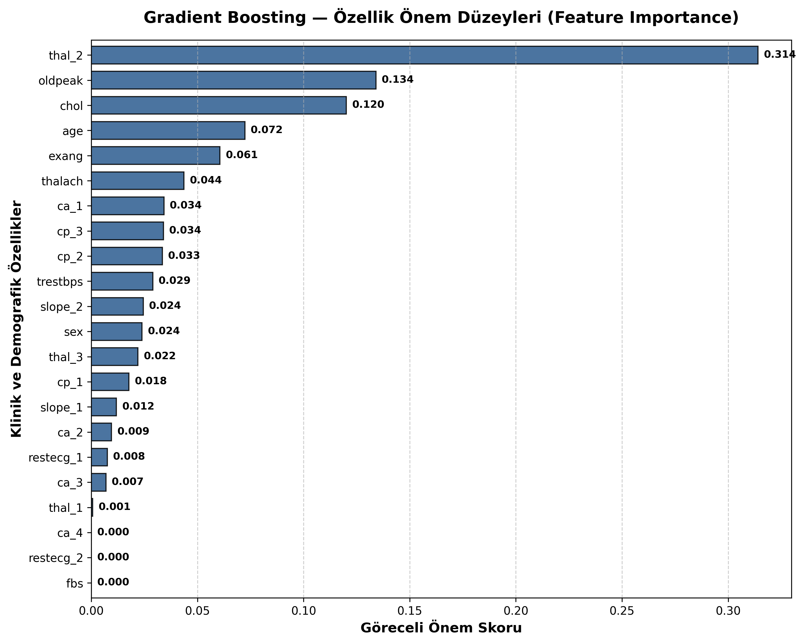

# 🫀 Heart Disease Prediction — Makine Öğrenmesi & Veri Madenciliği

> **Makine Öğrenmesi & Veri Madenciliği Projesi — 2026**  
> Python • Scikit-Learn • Pandas • Seaborn • Matplotlib • Jupyter Notebook  
> UCI Cleveland Heart Disease Veri Seti ile Çoklu Sınıflandırma ve Klinik Karar Destek Sistemi

[](https://www.python.org/)
[](https://scikit-learn.org/)
[](https://pandas.pydata.org/)
[](https://jupyter.org/)
[](https://opensource.org/licenses/MIT)

---

## 👤 Geliştirici

| İsim | Bölüm | GitHub | LinkedIn | İletişim / E-Posta |
|------|-------|--------|----------|-------------------|
| **Hüseyin Konak** | Bilgisayar Mühendisliği | [@huseyin-konak](https://github.com/huseyin-konak) | [linkedin.com/in/huseyin-konak](https://www.linkedin.com/in/huseyin-konak/) | [huseyinkonak.dev@gmail.com](mailto:huseyinkonak.dev@gmail.com) |

---

## 📑 İçindekiler

1. [Proje Hakkında](#-proje-hakkında)
2. [Sistem Mimarisi & Pipeline Akışı](#-sistem-mimarisi--pipeline-akışı)
3. [Veri Seti Tanımı ve Klinik Nitelikler](#-veri-seti-tanımı-ve-klinik-nitelikler)
4. [Veri Ön İşleme (Pre-processing)](#-veri-ön-işleme-pre-processing)
5. [Eğitilen Modeller](#-eğitilen-modeller)
6. [Performans Karşılaştırması ve Metrikler](#-performans-karşılaştırması-ve-metrikler)
7. [Karmaşıklık Matrisi (Confusion Matrix) & TP-FP-TN-FN Analizi](#-karmaşıklık-matrisi-confusion-matrix--tp-fp-tn-fn-analizi)
8. [ROC Eğrileri ve AUC Analizi](#-roc-eğrileri-ve-auc-analizi)
9. [Özellik Önemi (Feature Importance) ve Klinik Çıkarımlar](#-özellik-önemi-feature-importance-ve-klinik-çıkarımlar)
10. [Proje Dizin Yapısı](#-proje-dizin-yapısı)
11. [Kurulum ve Çalıştırma](#-kurulum-ve-çalıştırma)

---

## 🎯 Proje Hakkında

Bu proje, bireylerin klinik test, efor ve demografik verilerini kullanarak **kalp hastalığı riskini (1: Hasta, 0: Sağlıklı)** önceden tahmin eden uçtan uca bir makine öğrenmesi ve veri madenciliği çözümüdür.

Kardiyovasküler hastalıklar küresel olarak en yaygın ölüm nedenlerinden biridir. Tıbbi tanıda **False Negative (hastaya yanlışlıkla sağlıklı demek)** teşhisi ölümcül risk taşıdığından, model seçiminde yalnızca genel doğruluk (Accuracy) değil; **Duyarlılık (Recall)** ve **ROC-AUC** metrikleri temel odak noktası olarak ele alınmıştır.

---

## 🏗 Sistem Mimarisi & Pipeline Akışı

```
┌────────────────────────────────────────────────────────────────────────┐
│               UÇTAN UCA MAKİNE ÖĞRENMESİ PİPELİNE AKIŞI                │
│                                                                        │
│   ┌─────────────────────┐                                             │
│   │ Otomatik Veri       │  (GitHub Raw / UCI Cleveland Dataset)        │
│   │ Yükleyici           │  pandas.read_csv()                           │
│   └──────────┬──────────┘                                             │
│              │                                                         │
│   ┌──────────▼──────────┐                                             │
│   │ Keşifçi Veri        │  - Eksik Veri Denetimi (Missing Values: 0)   │
│   │ Analizi (EDA)       │  - Kutu Grafiği (Boxplot) ile Outlier Analizi│
│   └──────────┬──────────┘                                             │
│              │                                                         │
│   ┌──────────▼──────────┐                                             │
│   │ Veri Ön İşleme      │  - One-Hot Encoding (drop_first=True)        │
│   │ (Pre-processing)    │  - Train/Test Split (%80 - %20, stratify)   │
│   │                     │  - StandardScaler (Data Leakage Önlemli)     │
│   └──────────┬──────────┘                                             │
│              │                                                         │
│              ├──────────────────┬──────────────────┐                   │
│   ┌──────────▼──────────┐ ┌─────▼──────────┐ ┌─────▼──────────┐        │
│   │ Gradient Boosting   │ │ Decision Tree  │ │ Bayesian Net   │        │
│   │ Classifier          │ │ Classifier     │ │ (GaussianNB)   │        │
│   └──────────┬──────────┘ └─────┬──────────┘ └─────┬──────────┘        │
│              │                  │                  │                   │
│   ┌──────────▼──────────────────▼──────────────────▼──────────┐        │
│   │ Kapsamlı Değerlendirme & Görselleştirme                   │        │
│   │ - Confusion Matrix (TP, FP, TN, FN etiketli Heatmap)      │        │
│   │ - Karşılaştırmalı ROC-AUC Eğrileri                        │        │
│   │ - Gradient Boosting Feature Importance Bar Plot           │        │
│   └───────────────────────────────────────────────────────────┘        │
└────────────────────────────────────────────────────────────────────────┘
```

---

## 📊 Veri Seti Tanımı ve Klinik Nitelikler

Veri seti 303 örnek ve 14 temel öznitelikten oluşmaktadır:

| Nitelik | Tanım | Değer Aralığı / Tür |
|---------|-------|---------------------|
| `age` | Yaş | 29 - 77 (Yıl) |
| `sex` | Cinsiyet | 1 = Erkek, 0 = Kadın |
| `cp` | Göğüs Ağrısı Tipi | 0: Tipik Angina, 1: Atipik Angina, 2: Non-anginal, 3: Asemptomatik |
| `trestbps` | Dinlenme Kan Basıncı | mm Hg |
| `chol` | Serum Kolesterolü | mg/dl |
| `fbs` | Açlık Kan Şekeri > 120 mg/dl | 1 = Doğru, 0 = Yanlış |
| `restecg` | Dinlenme EKG Sonuçları | 0: Normal, 1: ST-T dalga anormalliği, 2: Sol ventrikül hipertrofisi |
| `thalach` | Ulaşılan Maksimum Kalp Hızı | Nabız |
| `exang` | Egzersiz Kaynaklı Angina | 1 = Evet, 0 = Hayır |
| `oldpeak` | Egzersiz Kaynaklı ST Çökmesi | Dinlenmeye göre depresyon miktarı |
| `slope` | Tepe Egzersiz ST Segment Eğimi | 0: Yukarı eğimli, 1: Düz, 2: Aşağı eğimli |
| `ca` | Floroskopi ile Boyanan Ana Damar Sayısı | 0 - 3 |
| `thal` | Talyum Stres Testi Sonucu | 1: Normal, 2: Sabit defekt, 3: Geri dönüşümlü defekt |
| **`target`** | **Hedef Değişken (Teşhis)** | **1 = Kalp Hastalığı Var, 0 = Kalp Hastalığı Yok** |

---

## ⚙️ Veri Ön İşleme (Pre-processing)

1. **Eksik Değer Analizi:** Veri setinde hiçbir eksik (null) hücre bulunmamaktadır.
2. **Aykırı Değer Analizi (IQR):** Sürekli sayısal değişkenler kutu grafikleri ile taranmış; fizyolojik olarak mümkün olan aşırı uçlar incelenmiştir.
3. **One-Hot Encoding:** Çok kategorili değişkenler (`cp`, `restecg`, `slope`, `ca`, `thal`) için dummy sütunlar türetilmiş, çoklu doğrusal bağlantıyı önlemek için `drop_first=True` kullanılmıştır.
4. **Veri Sızıntısı (Data Leakage) Koruması:** `StandardScaler`, **sadece eğitim setine** `fit` edilmiş, test setine sadece `transform` uygulanmıştır.



---

## 🤖 Eğitilen Modeller

| Model | Tip | Açıklama |
|-------|-----|----------|
| **Gradient Boosting** | Ensemble (Topluluk) | Hataları ardışık olarak düzelten zayıf karar ağaçları optimizasyonu. |
| **Decision Tree** | Kural Tabanlı Ağaç | Veriyi bilgi kazancına göre en uygun dallara ayıran şeffaf model. |
| **Bayesian Network (GaussianNB)** | Olasılıksal Sınıflandırıcı | Özelliklerin koşullu bağımsızlığı varsayımı altında Bayes kuralını uygulayan model. |

---

## 📈 Performans Karşılaştırması ve Metrikler

Eğitilen modellerin %20 ayrılmış test seti üzerindeki doğrulama sonuçları:

| Model | Accuracy (Doğruluk) | Precision (Kesinlik) | Recall (Duyarlılık) | F1-Score | ROC-AUC |
| :--- | :---: | :---: | :---: | :---: | :---: |
| 🥇 **Bayesian Network (GaussianNB)** | **%85.25** | **0.8529** | **%87.88** | **0.8657** | **0.9058** |
| 🥈 **Gradient Boosting** | %75.41 | 0.7500 | %81.82 | 0.7826 | 0.8604 |
| 🥉 **Decision Tree** | %73.77 | 0.7429 | %78.79 | 0.7647 | 0.7835 |



---

## 🧮 Karmaşıklık Matrisi (Confusion Matrix) & TP-FP-TN-FN Analizi

Tıbbi teşhislerde hata türleri eşit öneme sahip değildir:
- **True Positive (TP):** Kalp hastası olan ve doğru teşhis edilen bireyler.
- **True Negative (TN):** Sağlıklı olan ve doğru teşhis edilen bireyler.
- **False Positive (FP - Tip I Hata):** Sağlıklı kişiye yanlışlıkla "hasta" denilmesi (ek tetkiklerle düzeltilebilir).
- **False Negative (FN - Tip II Hata):** Hasta kişiye yanlışlıkla "sağlıklı" denilip taburcu edilmesi (**en tehlikeli klinik hata**).

Gaussian Naive Bayes, yalnızca **4 hastayı** kaçırarak (%87.88 Duyarlılık) klinik olarak en güvenilir model olmuştur.



---

## 📉 ROC Eğrileri ve AUC Analizi

Modellerin sınıflandırma eşiğinden bağımsız ayırt edicilik gücünü gösteren ROC eğrileri:
- **GaussianNB (AUC = 0.906):** Mükemmel düzeyde sınıf ayrımı.
- **Gradient Boosting (AUC = 0.860):** Güçlü genelleme kapasitesi.



---

## 🔍 Özellik Önemi (Feature Importance) ve Klinik Çıkarımlar

Gradient Boosting modeli üzerinde yapılan özellik önemi analizi, kalp hastalığı riskini en çok artıran klinik bulguları ortaya koymuştur:

1. **Göğüs Ağrısı Tipi (`cp_2`, `cp_1`):** Atipik veya anjinal olmayan göğüs ağrıları birinci derecede belirleyicidir.
2. **Maksimum Kalp Hızı (`thalach`):** Efor testinde yeterli tepe nabza ulaşamamak güçlü bir kardiyak risk göstergesidir.
3. **ST Depresyonu (`oldpeak`):** EKG'de egzersiz kaynaklı ST çökmesi miyokardiyal iskemiye işaret eder.
4. **Boyanan Damar Sayısı (`ca_1`, `ca_2`):** Floroskopide tıkalı ana damar sayısı doğrudan kalp krizi riskini katlamaktadır.



---

## 📂 Proje Dizin Yapısı

```
Heart-Disease-Prediction/
├── data/
│   └── raw/
│       └── heart.csv                       # Orijinal veri seti kopyası
├── notebooks/
│   └── Heart_Disease_Analysis.ipynb        # Adım adım çalıştırılabilir Jupyter Notebook
├── src/
│   ├── __init__.py
│   ├── data_loader.py                      # İnternetten veri çekme ve sağlık kontrolü
│   ├── preprocessor.py                     # Outlier analizi, One-Hot Encoding, StandardScaler
│   ├── train.py                            # Model tanımlama ve toplu eğitim modülü
│   └── evaluate.py                         # Confusion Matrix, ROC-AUC ve grafik üretim modülü
├── reports/
│   └── figures/                            # 300 DPI yüksek çözünürlüklü grafikler
│       ├── outlier_boxplots.png
│       ├── scaling_distribution_comparison.png
│       ├── models_performance_comparison.png
│       ├── confusion_matrices.png
│       ├── roc_curves_comparison.png
│       └── feature_importance_gradient_boosting.png
├── main.py                                 # Tek komutla tüm pipeline'ı çalıştıran script
├── requirements.txt                        # Gerekli Python kütüphaneleri
├── .gitignore                              # Git yapılandırma dosyası
└── README.md                               # Kapsamlı proje dokümantasyonu
```

---

## 🚀 Kurulum ve Çalıştırma

### 1. Repoyu Klonlayın
```bash
git clone https://github.com/huseyin-konak/Heart-Disease-Prediction.git
cd Heart-Disease-Prediction
```

### 2. Bağımlılıkları Yükleyin
```bash
pip install -r requirements.txt
```

### 3. Pipeline'ı Çalıştırın
Tüm veri çekme, ön işleme, model eğitimi ve grafik üretim adımlarını tek komutla koşturmak için:
```bash
python main.py
```

### 4. Jupyter Notebook ile Etkileşimli İnceleyin
```bash
jupyter notebook notebooks/Heart_Disease_Analysis.ipynb
```

---

## 📄 Lisans

Bu proje [MIT Lisansı](LICENSE) kapsamında açık kaynak olarak sunulmuştur.
